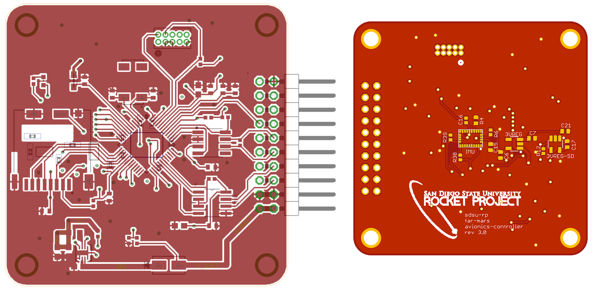

# far-mars-avionics-controller

The **far-mars-avionics-controller** is a custom built printed circuit board that performs data aquisition, logging, and communication, all in one highly power effecient, light weight, and compact design. This circuit was built around the FAR/MARS rocket competition, which challenges teams to design a LOX/Methane rocket to accuratley target an altitude of 45,000 feet.

### Features
* Dual(5V/3.3V) Supply ARM Cortex M0+ microcontroller
* 9 multi-purpose 5V I/O pins (+1 DIO PIN)
* Up to 9 12bit and 2 16bit Analog to Digital channels.
* RS-485 Transceiver for long distance LVDS ground communications
* CANbus Transceiver for future feature expansion(untested)
* BNO055 Inertial Measurement Unit
* Locking microSD card slot for secure, vibration resistant data logging
* 5-17V Input Range allowing for versatile power supply.
* Power Effecient enabling the use of a tiny battery
* Very light, weighs less than an ounce!
* Built-in battery charge monitoring.
* Highly accurate crystal for detailed timestamping.

### Firmware

The FAR/MARS rocket uses a FreeRTOS implementation to safley and predictabley manage the various avionics tasks required to launch the rocket. Documentation and development of the firmware for this board can be found in our [far-mars-onboard-firmware](https://github.com/SDSURocketProject/far-mars-onboard-firmware) repository. 

### Documentation
Here is everything you need to interface with this PCB and/or to write your own drivers and firmware:
* [Pinout](/documentation/pinout.pdf "Pinout")
* [Schematic](/documentation/schematic.pdf "Schematic")
* [Mechanical Drawing](/documentation/mech_drawing.pdf "Drawing")
* [Device Datasheet Collection](/documentation/Datasheets "Device Datasheet Collection")

### Assembly
It is highly recommend that you outsource the assembly of this PCB. This design has a lot of tiny surface mount components, on both sides of the board, so unless you have experience reflowing on two sides, this will be almost impossible to assemble yourself. We used MacroFab for the most recent version of this PCB. The current BOM is also optimized to take advantage of their 10-day turnaround service. Here is everything you need to assemble your own avionics controller:
* [Assembly Guide](/assembly#assembly-guide "Instructions")
* [Bill of Materials](/assembly/BOM#bill-of-materials "Bill of Materials")
* [Gerber Files](/assembly/Gerbers)
* [Design Slides](/assembly/Physical%20Summary.pdf "Physical Summary")
* **Schematic & Layout Files are in the top directory**

### Remarks
The far-mars-avionics-controller is entirley functional and usable on any system with similar requirements to the FAR/MARS Lady Elizabeth rocket. Furthermore the CANbus port included in the design, once tested, will also allow for the PCB to interface with virtually any existing CANbus compatible product/system(e.g. Motor Controllers, Thermocouple modules). 

That all said the main purpose of this project was to demonstrate SDSU Rocket Projects ability to design highly purpose built custom electronics, and it was specifically designed around the rules specified by the FAR/MARS rocket competition. This PCB is far from being an all in one solution to any Avionics requirments you may have. The design may find most of its value as a supplement to a larger system. 

